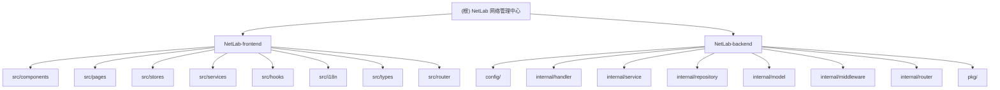

# CLAUDE.md

This file provides guidance to Claude Code (claude.ai/code) when working with code in this repository.

## Project Overview

NetLab is a Network Management Center for real network operations. It uses a React frontend and Go backend to manage real routers, switches, firewalls, load balancers, and other infrastructure devices. The product direction is a comprehensive operations platform with device inventory, SNMP monitoring, Syslog aggregation, RADIUS authentication/auditing, alert policies, and operational dashboards.

| Layer | Stack | Directory |
|-------|-------|-----------|
| Frontend | React 19 · TypeScript 6 · Ant Design 6.x · Vite 8 · Zustand 5 · React Router 7 · i18next | `NetLab-frontend/` |
| Backend | Go 1.25 · Gin · GORM · PostgreSQL · Redis · JWT · Zap · Casbin | `NetLab-backend/` |

**Detailed frontend conventions** (component patterns, CSS architecture, i18n rules, design tokens) are in `NetLab-frontend/CLAUDE.md`. Read that file before working on any frontend code.

**Detailed backend conventions** (layered architecture, API routes, RBAC, auth flows, error codes) are in `NetLab-backend/CLAUDE.md`. Read that file before working on any backend code.

## Module Structure



## Common Commands

### Frontend (`NetLab-frontend/`)

```bash
pnpm dev              # Start Vite dev server (default: http://localhost:5173)
pnpm build            # Production build
pnpm lint             # oxlint (zero warnings required)
pnpm preview          # Preview production build
pnpm i18n:check       # Run i18n audit script
pnpm check            # Full check: i18n + lint + build
```

### Backend (`NetLab-backend/`)

```bash
make build            # go build -o bin/netlab-server .
make run              # Build + run
make dev              # Hot-reload via air
make test             # go test ./... -v -cover
make test-race        # go test ./... -v -race
make lint             # golangci-lint run ./...
make swagger          # Generate Swagger docs from annotations
make docker-up        # Start PostgreSQL + Redis (AutoMigrate runs on server startup)
make docker-down      # Stop infrastructure containers
```

## Repository Structure

```
NetLab/
├── CLAUDE.md                    # This file (root-level guidance)
├── .claude/
│   └── index.json               # Scan index: coverage, module list, gaps (auto-generated)
├── NetLab-frontend/             # React SPA
│   ├── CLAUDE.md                # Frontend development constitution (READ FIRST)
│   ├── src/
│   │   ├── assets/css/          # Page/component-owned CSS files
│   │   ├── components/          # layout/, auth/, common/
│   │   ├── pages/               # login/, dashboard/, account/, settings/, error/
│   │   ├── router/              # Single-file route config (React Router 7)
│   │   ├── stores/              # Zustand: appStore, authStore, operationsStore
│   │   ├── services/            # Axios instance + API service objects (auth, admin, rbac, authSecurity, request)
│   │   ├── hooks/               # useAuth, usePasskey, useI18n, useResolvedTheme, usePermission
│   │   ├── theme/               # Ant Design theme configuration
│   │   ├── i18n/                # i18next init + zh-CN/en-US locale JSONs (5 namespaces)
│   │   ├── types/               # TypeScript DTOs (auth, api, i18n, operations, settings)
│   │   └── utils/               # crypto, auth-flow, auth-normalize, password-strength, i18n-bridge, etc.
│   └── docs/                    # api-for-ai-agents.md, ui-redesign-proposal.md
└── NetLab-backend/              # Go API server
    ├── CLAUDE.md                # Backend module documentation (READ FIRST)
    ├── main.go                  # Entry point: config -> DB/Redis -> repos -> services -> handlers -> router
    ├── config/config.go         # Viper-based env config (all structs + Load())
    ├── internal/
    │   ├── router/              # Gin route setup with rate-limited endpoint groups
    │   ├── middleware/           # auth (JWT/Casbin), cors, i18n, ratelimit, recovery, requestid, signature
    │   ├── handler/
    │   │   ├── auth/            # AuthHandler: login, register, passkey, OAuth, 2FA, account management
    │   │   ├── admin/           # AdminHandler: system settings, user CRUD, batch operations, import/export
    │   │   └── rbac/            # Handler: role/permission CRUD
    │   ├── service/
    │   │   ├── auth/            # Auth, crypto, token, password, verification, passkey, OAuth, 2FA, admin, user-admin, import
    │   │   ├── rbac/            # Casbin enforcer, role/permission CRUD, policy seeding
    │   │   └── config/          # Runtime config service (DB-backed, cached)
    │   ├── repository/          # Data access: user, token (Redis), passkey, oauth_binding, config, one_time_token
    │   ├── model/               # GORM models: user, passkey, role, permission, role_permission, system_config, oauth_binding
    │   ├── dto/                 # request/response DTOs for auth, admin, rbac
    │   ├── database/            # PostgreSQL + Redis connection setup + auto-migration + seed functions
    │   ├── mailer/              # Email sender (hot-loads SMTP from config service)
    │   ├── contextkeys/         # Gin context key constants
    │   └── validation/          # Request validation + password strength rules
    ├── pkg/
    │   ├── jwt/                 # JWT manager (access + refresh tokens, HS256/RS256, blacklist interface)
    │   ├── captcha/             # Math captcha generation with Redis store
    │   ├── crypto/              # AES-GCM, Argon2id hash, HMAC-SHA256, key derivation
    │   ├── email/smtp.go        # SMTP email sender
    │   ├── response/response.go # Standardized API response envelope
    │   ├── apperrors/errors.go  # Typed application errors with i18n codes (25 error codes)
    │   └── i18n/                # go-i18n bundle initialization
    ├── messages/                # zh-CN.json, en-US.json (server-side i18n)
    ├── docs/                    # Swagger generated docs
    └── docker-compose.yml       # PostgreSQL 16 + Redis 7
```

## Backend Architecture

### Layered Architecture (top -> bottom)

```
Handler (HTTP) -> Service (business logic) -> Repository (data access) -> DB/Redis
```

- **Handlers** parse requests, call services, return responses. No business logic.
- **Services** contain all business logic, orchestrate repos and external services.
- **Repositories** encapsulate GORM and Redis operations. One repo per aggregate root.
- **Models** are GORM entities with struct tags for both DB columns and JSON serialization.

### API Response Envelope

All endpoints return `{ code: number, data: T, message: string }`. Success codes: `0` or `200`. The frontend Axios interceptor auto-unwraps this -- service functions receive `data` directly.

### Authentication Flow

1. **Signature-protected endpoints** (`/auth/login`, `/auth/register`, `/auth/reset-password`): Client signs requests with HMAC-SHA256 using `AUTH_SIGNATURE_KEY` + `AUTH_SIGNATURE_SALT`. Backend `Signature` middleware verifies before the handler runs. Request body is sent as cleartext over HTTPS.

2. **Public endpoints** (`/auth/refresh`, `/auth/captcha`, `/auth/send-code`, passkey/OAuth flows): Optional JWT auth -- attaches user info if a valid token is present but does not reject unauthenticated requests.

3. **Authenticated endpoints** (`/auth/userinfo`, `/auth/logout`, passkey registration, account management, admin routes): `RequireAuth` middleware enforces valid JWT + blacklist check. Admin/mutation routes additionally require `RequireRBAC` middleware (Casbin enforcer).

4. **Token refresh**: Access tokens expire in 15 min, refresh tokens in 7 days. The frontend proactively refreshes 5 min before expiry and retries on 401 with a queue to prevent concurrent refresh storms.

### Rate Limiting Tiers

| Tier | Limit | Endpoints |
|------|-------|-----------|
| Very strict | 3 req/min per IP | `/auth/send-code`, account email code |
| Strict | 5 req/min per IP | `/auth/login`, `/auth/reset-password`, `/auth/refresh`, passkey verify, OAuth bind/create, 2FA login, change-password, SMTP test, user import |
| Moderate | 15 req/min per IP | `/auth/register`, `/auth/captcha`, passkey/OAuth, `/auth/config`, settings write, user CRUD |
| Standard | 60 req/min per IP | `/auth/userinfo`, `/auth/logout`, passkey registration/list, RBAC read, settings read, user list/export |
| Global | 100 req/min per IP | All routes (applied before endpoint-specific limits) |

### Middleware Chain (execution order)

```
RequestID -> CORS -> Recovery -> I18N -> GlobalRateLimit -> [OptionalAuth | RequireAuth] -> [RequireRBAC] -> [Signature] -> [EndpointRateLimit] -> Handler
```

### RBAC (Casbin)

Uses `casbin/casbin/v3` with GORM adapter. Built-in roles: super_admin, admin, editor, viewer. Policies stored in `nb_policies` table, synced from `nb_roles` + `nb_permissions` + `nb_role_permissions` tables. Built-in resources: user, device, alert, syslog, setting, dashboard, audit_log, group, rbac, auth.

### Database Tables (GORM AutoMigrate)

| Table | Model | Purpose |
|-------|-------|---------|
| `nb_users` | User | User accounts (username, email, phone unique, role FK) |
| `nb_passkeys` | Passkey | WebAuthn credentials |
| `nb_roles` | Role | Role definitions (super_admin, admin, editor, viewer) |
| `nb_permissions` | Permission | Fine-grained resource:action permissions |
| `nb_role_permissions` | RolePermission | Many-to-many role-permission mapping |
| `nb_system_configs` | SystemConfig | Key-value runtime config (SMTP, OAuth, security, beian) |
| `nb_policies` | (Casbin) | Casbin RBAC policies (sub, obj, act) |
| `nb_oauth_bindings` | OAuthBinding | OAuth provider-to-user bindings |

## Frontend-Backend Contract

### Signature Keys (must match)

Two environment variables must be identical between frontend and backend:

| Frontend (.env.local) | Backend (.env) | Purpose |
|------------------------|----------------|---------|
| `VITE_AUTH_SIGNATURE_KEY` | `AUTH_SIGNATURE_KEY` | HMAC-SHA256 request signing |
| `VITE_AUTH_SIGNATURE_SALT` | `AUTH_SIGNATURE_SALT` | Signature payload salt |

Note: `CONFIG_ENCRYPTION_KEY` (backend-only) is the AES-256-GCM master key for encrypting sensitive config values (SMTP passwords, OAuth secrets) stored in the database. It falls back to `AUTH_SIGNATURE_KEY` if not explicitly set.

### API Base URL

The frontend proxies `/api` to the backend. Set `VITE_API_BASE_URL` in `.env.local` to the backend address (default: `http://localhost:8080/api`).

## Infrastructure

```bash
# Start PostgreSQL 16 + Redis 7
cd NetLab-backend && make docker-up

# Start backend (reads .env)
cd NetLab-backend && make dev

# Start frontend (reads .env.local)
cd NetLab-frontend && pnpm dev
```

PostgreSQL runs on port 5432 (user: `netlab`, db: `netlab`). Redis runs on port 6379. In `debug` mode, the backend auto-migrates GORM models and seeds default OAuth configs and two admin accounts (superadmin/superadmin, admin/admin -- both forced to change password and email on first login).

## Phase Roadmap

| Phase | Status | Scope |
|-------|--------|-------|
| Phase 1 | Done | Layout shell, theme, routing, i18n, auth, RBAC, dashboard device-group list, placeholder pages |
| Phase 2 | Planned | Device inventory, site/group management, device details, real network topology view |
| Phase 3 | Planned | SNMP polling, metric trends, interface monitoring, Syslog ingestion and search |
| Phase 4 | Planned | RADIUS authentication/auditing, alert policies, notification workflows, responsive operations workspace |

## .context Project Context

> Project uses `.context/` for development decision context management.

- Coding standards: `.context/prefs/coding-style.md`
- Workflow rules: `.context/prefs/workflow.md`
- Decision history: `.context/history/commits.md`

**Rule**: Read `prefs/` before modifying code; log decisions per `workflow.md` rules.

## Changelog

| Date | Change |
|------|--------|
| 2026-07-18 | Added Mermaid module structure diagram; added backend module CLAUDE.md with full API/route/RBAC/auth documentation; updated repository structure to reflect RBAC additions and backend reorganization (handler/rbac, handler/admin, service/rbac, mailer, validation, contextkeys); updated rate limiting tiers and middleware chain; updated DB tables list; added changelog section; added breadcrumb navigation in frontend and backend CLAUDE.md |
| (earlier) | Initial CLAUDE.md created with project overview, architecture, and development conventions |
